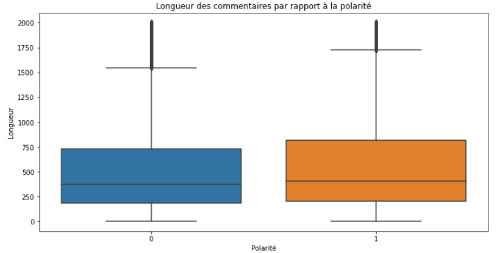
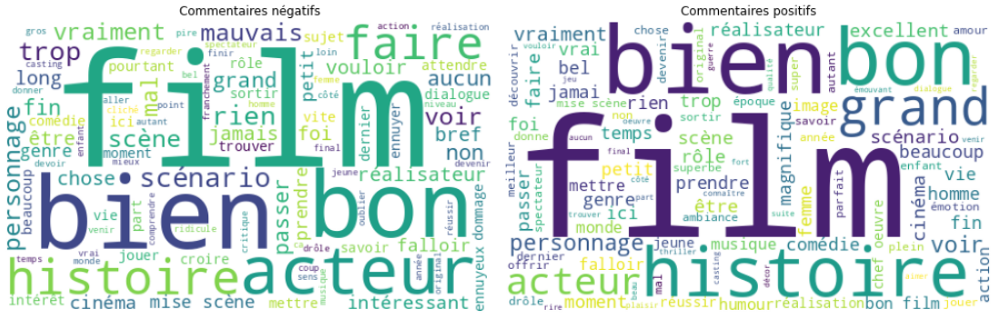
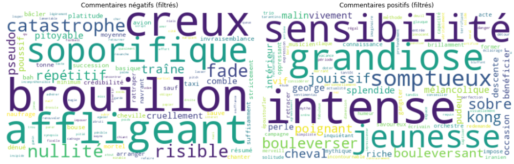
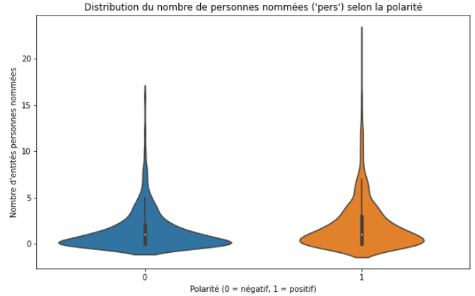

# Sentiment Analysis on Allociné Movie Reviews

**Natural Language Processing (NLP) AI & GenAI**  
This project is a practical application of text classification using Natural Language Processing (NLP) techniques on French-language movie reviews scraped from Allociné. The goal is to automatically classify movie reviews as positive or negative and explore text features using visualization, entity recognition, and similarity-based classification.

---

## Dataset

- **Source:** Allociné (French movie review website)  
- **Files:**
  - `allocine_train.csv` – training data (160,000 reviews)
  - `allocine_test.csv` – test data
- **Features:**
  - `review`: the raw text of the review
  - `polarity`: 0 = negative, 1 = positive

---

## Project Steps

### 1. Data Exploration

#### Load Dataset
(a) I import the dataset allocine_train.csv and keep only the columns review and polarity. Then, I display the first 10 rows.

```python
import pandas as pd

df = pd.read_csv("allocine_train.csv")
df = df[['review', 'polarity']]
df.head(10)
```
**Output:**


#### Polarity Distribution
(b) I display the distribution of the target variable, polarity.
```python
df['polarity'].value_counts()
```

**Output:**

```
1    80587
0    79413
```

#### Review Length by Polarity
(c) I add a column length with the length of each review. Then, I display the distribution of this variable according to the polarity.
```python
import matplotlib.pyplot as plt
import seaborn as sns

df['length'] = df['review'].apply(lambda x: len(str(x)))

plt.figure(figsize=(12, 6))
sns.boxplot(x='polarity', y='length', data=df)
plt.title("Review Length by Polarity")
plt.xlabel("Polarity")
plt.ylabel("Length")
plt.show()
```
**Output:**


---

### 2. Word Clouds
(d) I create a cleaning function using the spaCy model fr_core_news_lg to convert text to lowercase, remove punctuation and stopwords, then I apply it to the dataset.

```python
import spacy
nlp = spacy.load("fr_core_news_lg")

def cleaning(text):
    doc = nlp(text)
    cleaned = [token.lemma_.lower() for token in doc
               if not token.is_stop and not token.is_punct and token.is_alpha]
    return " ".join(cleaned)

sample_df = df.sample(frac=0.01, random_state=42).copy()
sample_df['cleaned_review'] = sample_df['review'].apply(lambda x: cleaning(str(x)))
```

#### Word Clouds for Positive and Negative Reviews
(e) I display two word clouds: one for positive reviews and one for negative reviews.
#### Text Cleaning Using spaCy

```python
# Importing libraries
from wordcloud import WordCloud
import matplotlib.pyplot as plt

# Splitting texts in positives and negatives
text_pos = " ".join(sample_df[sample_df['polarity'] == 1]['cleaned_review'])
text_neg = " ".join(sample_df[sample_df['polarity'] == 0]['cleaned_review'])

# Create the wordcloud
wc_pos = WordCloud(background_color="white", 
                   max_words=100, 
                   width=500, 
                   height=300, 
                   random_state=42).generate(text_pos)

wc_neg = WordCloud(background_color="white", 
                   max_words=100, 
                   width=500, 
                   height=300, 
                   random_state=42).generate(text_neg)

# Display the wordcloud
fig, axes = plt.subplots(1, 2, figsize=(14, 6))

axes[0].imshow(wc_neg)
axes[0].set_title("Commentaires négatifs")
axes[0].axis("off")

axes[1].imshow(wc_pos)
axes[1].set_title("Commentaires positifs")
axes[1].axis("off")

plt.tight_layout()
plt.show()
```
**Output:**



#### Removing Common Words for Better Contrast
(f) I propose and apply one or more solutions to better differentiate the two word clouds. For example, I remove words common to both categories.

```python
# to create a contrast in between both wordclouds, I thought about removing common words from both.

# Importing libraries
from collections import Counter
from wordcloud import WordCloud
import matplotlib.pyplot as plt

# Splitting positive and negative texts
text_pos = " ".join(sample_df[sample_df['polarity'] == 1]['cleaned_review'])
text_neg = " ".join(sample_df[sample_df['polarity'] == 0]['cleaned_review'])

# I count words in each categories
words_pos = text_pos.split()
words_neg = text_neg.split()

count_pos = Counter(words_pos)
count_neg = Counter(words_neg)

# Fetching common words appearing atleast 10 times
common_words = set([word for word in count_pos if word in count_neg and count_pos[word] + count_neg[word] > 10])

# Deleting those from texts
text_pos_filtered = " ".join([w for w in words_pos if w not in common_words])
text_neg_filtered = " ".join([w for w in words_neg if w not in common_words])

# Creating wordclouds
wc_pos = WordCloud(background_color="white", 
                   max_words=100, 
                   width=500, 
                   height=300, 
                   random_state=42).generate(text_pos_filtered)

wc_neg = WordCloud(background_color="white", 
                   max_words=100, 
                   width=500, 
                   height=300, 
                   random_state=42).generate(text_neg_filtered)

# Display filtered wordclouds
fig, axes = plt.subplots(1, 2, figsize=(14, 6))

axes[0].imshow(wc_neg)
axes[0].set_title("Commentaires négatifs (filtrés)")
axes[0].axis("off")

axes[1].imshow(wc_pos)
axes[1].set_title("Commentaires positifs (filtrés)")
axes[1].axis("off")

plt.tight_layout()
plt.show()
```
**Output:**



---

### 3. Named Entity Recognition (NER)
(g) I add a column pers to the dataset containing the number of entities labeled as PERS found in each review.
#### Count Person Entities in Each Review

```python
import spacy

nlp = spacy.load("fr_core_news_lg")

# Function to count PER entities
def count_pers(text):
    doc = nlp(text)
    return len([ent for ent in doc.ents if ent.label_ == "PER"])

sample_df['pers'] = sample_df['review'].apply(lambda x: count_pers(str(x)))
```

#### Example Extracted Entities
(h) I display five named entities extracted from the reviews.
```python
entities = []

# Going through the 5 first lines of the dataframe & fetch every named entities
for text in sample_df['review'].head(100):
    doc = nlp(text)
    entities.extend([ent.text for ent in doc.ents])
    if len(entities) >= 5:
        break
# Printing the 5 first named entities
print(entities[:5])
```

**Output:**

```
['Paris', 'Référence', 'Bogart', 'Le Violent', 'Hitchcock']
```

#### Violin Plot: Person Entities by Polarity
(i) I display a violin plot showing the density of named persons (pers) for each polarity. Then, I interpret what can be concluded.
```python
import seaborn as sns
import matplotlib.pyplot as plt

# Violin graph : amount of entities 'pers' based on the polarity
plt.figure(figsize=(10, 6))
sns.violinplot(x='polarity', y='pers', data=sample_df)
plt.title("Distribution of Named Person Entities by Polarity")
plt.xlabel("Polarity (0 = Negative, 1 = Positive)")
plt.ylabel("Count of Person Entities")
plt.show()
```
**Output :**


**Observation:** The number of named persons (`PER`) is not significantly different between positive and negative reviews.

---

### 4. Classification via Text Similarity (spaCy)
(j) I propose a solution to classify reviews according to their polarity using the similarity method provided by spaCy. I display the accuracy score obtained.
#### Reference Sentences

```python
doc_pos = nlp("Absolutely amazing! Beautiful direction and perfect acting. 1h50 of joy.")
doc_neg = nlp("Very slow and boring. I definitely do not recommend watching this film.")
```

#### Predicting Sentiment by Similarity

```python
from sklearn.metrics import accuracy_score

def predict_polarity(text):
    doc = nlp(text)
    sim_pos = doc.similarity(doc_pos)
    sim_neg = doc.similarity(doc_neg)
    return 1 if sim_pos > sim_neg else 0

sample_df['predicted_polarity'] = sample_df['review'].apply(predict_polarity)
accuracy = accuracy_score(sample_df['polarity'], sample_df['predicted_polarity'])
print(f"Accuracy with spaCy similarity: {accuracy:.3f}")
```

**Output:**

```
Accuracy with spaCy similarity: 0.612
```

#### Most Similar Positive Review
(k) I display the positive review that is most similar to our example phrase. I conclude on the effectiveness of our approach.
```python
similarities = sample_df['review'].apply(lambda x: nlp(x).similarity(doc_pos))
idx_most_similar = similarities.idxmax()

print("Most similar positive review:")
print(sample_df.loc[idx_most_similar, 'review'])
print(f"Similarity Score: {similarities[idx_most_similar]:.3f}")
```

**Example Output:**

```
"My little girls (10 and 6 years old) and I loved it. The drawings are beautiful as well as the music. The poetry of Nature and Life shown through the images, the simplicity of the drawings, the rhythm... made us feel really good."
Similarity Score: 0.861
```

---

## Conclusion

- The spaCy similarity method is quick and easy to implement but not sufficiently accurate.
- Advanced models like supervised learning or transformer-based approaches (e.g., CamemBERT) would likely improve performance significantly.

---

## Skills Applied

- French text preprocessing with spaCy  
- Data visualization using WordCloud and Seaborn  
- Named Entity Recognition (NER)  
- Text similarity-based sentiment classification  
- Model evaluation with accuracy score  

---

## Suggestions for Improvement

- Train traditional classifiers (Logistic Regression, Naive Bayes, etc.)
- Use TF-IDF or contextual embeddings (e.g., CamemBERT, Sentence Transformers)
- Build a full NLP pipeline: Preprocessing → Feature Extraction → Model Training → Evaluation

---

## Resources

- [spaCy – French NLP Models](https://spacy.io/usage/models/fr)  
- [WordCloud Python Library](https://github.com/amueller/word_cloud)  
- [Seaborn Violinplot Documentation](https://seaborn.pydata.org/generated/seaborn.violinplot.html)

---

